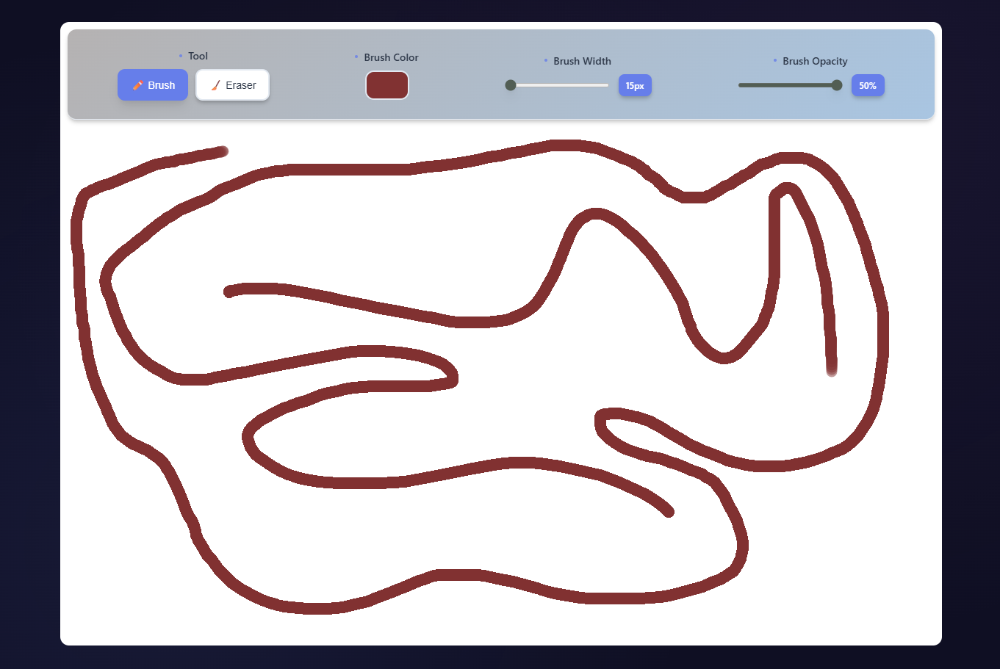

# 🎨 Doodle Doo - Web Drawing Application

A modern, feature-rich drawing application built with React, TypeScript, and Vite. Create digital artwork with an intuitive interface featuring customizable brushes, an eraser tool, and real-time drawing capabilities.

## 🚀 Features

### Drawing Tools
- **🖌️ Brush Tool**: Customizable brush with adjustable:
  - Color picker for unlimited color options
  - Brush width (15px - 70px)
  - Opacity control (0% - 50%)
  
- **🧹 Eraser Tool**: Powerful eraser with:
  - Grab cursor for intuitive erasing
  - Same size controls as brush for consistency
  - Full opacity erasing for complete removal

### User Interface
- **Modern Design**: Glass-morphism effects with smooth animations
- **Responsive Layout**: Works seamlessly on desktop and mobile devices
- **Visual Feedback**: 
  - Dynamic cursor changes based on tool selection
  - Active tool highlighting with gradient backgrounds
  - Hover effects and smooth transitions
- **Canvas Boundaries**: Clear visual distinction between drawing area and interface

### Technical Features
- **TypeScript**: Full type safety for better development experience
- **Component Architecture**: Clean, modular component structure
- **Real-time Drawing**: Smooth, responsive drawing experience
- **Cross-browser Compatible**: Works on all modern browsers

## 📸 Application Preview

<!-- TODO: Add screenshot here -->



## 🛠️ Installation & Setup

### Prerequisites
- Node.js (v18 or higher)
- npm or yarn

### Installation Steps

1. **Clone the repository**
   ```bash
   git clone https://github.com/yourusername/doodle-doo.git
   cd doodle-doo
   ```

2. **Install dependencies**
   ```bash
   npm install
   ```

3. **Start development server**
   ```bash
   npm run dev
   ```

4. **Open in browser**
   Navigate to `http://localhost:5173` (or the port shown in terminal)

## 🎮 Usage Guide

### Getting Started
1. Open the application in your browser
2. Select the **Brush Tool** (default) to start drawing
3. Choose your preferred color, brush size, and opacity
4. Click and drag on the canvas to draw

### Using the Eraser
1. Click the **🧹 Eraser** button in the toolbar
2. Your cursor will change to a grab hand
3. Click and drag to erase content
4. The cursor will show "grabbing" while actively erasing

### Tool Controls

#### Brush Controls
- **Color Picker**: Click to select any color
- **Width Slider**: Adjust brush thickness (15-70px)
- **Opacity Slider**: Control transparency (0-50%)

#### Keyboard Shortcuts
- Currently in development - planned features coming soon!

## 🏗️ Project Structure

```
doodle-doo/
├── src/
│   ├── components/
│   │   ├── CanvasPage.tsx    # Main canvas and drawing logic
│   │   ├── Menu.tsx          # Tool controls and settings
│   │   └── Menu.css          # Styling for controls
│   ├── App.tsx               # Main application component
│   ├── App.css               # Global and canvas styling
│   ├── index.css             # CSS variables and base styles
│   └── main.tsx              # Application entry point
├── docs/                     # Documentation and screenshots
├── public/                   # Static assets
└── package.json              # Dependencies and scripts
```

## 🧩 Technology Stack

- **Frontend**: React 18 with TypeScript
- **Build Tool**: Vite
- **Styling**: CSS3
- **Icons**: Native emoji support
- **Package Manager**: npm

## 🚦 Scripts

```bash
# Start development server
npm run dev

# Build for production
npm run build

# Preview production build
npm run preview

# Run ESLint
npm run lint

# Run type check
npm run tsc --noEmit
```

## 🔧 Development

### Adding New Features
- New tools can be added to the `Menu.tsx` component
- Canvas logic is handled in `CanvasPage.tsx`
- Styling follows the existing CSS variable system

### Code Style
- TypeScript for type safety
- Functional components with hooks
- CSS variables for consistent theming
- Responsive design principles

## 🐛 Troubleshooting

### Common Issues

**Cursor not changing when switching tools:**
- Ensure JavaScript is enabled
- Try refreshing the page
- Check browser console for errors

**Canvas not responding to mouse events:**
- Make sure you're clicking within the canvas boundaries
- Check that the canvas is properly loaded
- Try resizing the browser window

**Performance issues:**
- Clear browser cache
- Ensure you're using a modern browser
- Close other resource-intensive applications

## 🗺️ Roadmap

### Planned Features
- [ ] Keyboard shortcuts for tool switching
- [ ] Undo/Redo functionality
- [ ] Save/Load drawings
- [ ] Multiple brush types (round, square, spray)
- [ ] Layer support
- [ ] Export options (PNG, JPEG, SVG)
- [ ] Touch support for tablets
- [ ] Color palette presets
- [ ] Shape tools (line, circle, rectangle)

### Enhancements
- [ ] Dark mode support
- [ ] Collaborative drawing
- [ ] Drawing history
- [ ] Custom brush creation
- [ ] Advanced color picker

## 🤝 Contributing

1. Fork the repository
2. Create a feature branch: `git checkout -b feature/amazing-feature`
3. Commit your changes: `git commit -m 'Add amazing feature'`
4. Push to the branch: `git push origin feature/amazing-feature`
5. Open a Pull Request

## 📝 License

This project is licensed under the MIT License - see the [LICENSE](LICENSE) file for details.

## 👥 Author

**Dinuka Liyanage** - *Initial work* - [Dinuka Liyanage](https://github.com/dinukaly)

## 🙏 Acknowledgments

- React team for the amazing framework
- Vite for the lightning-fast build tool
- The open-source community for inspiration and tools

---

**Happy Drawing! 🎨**